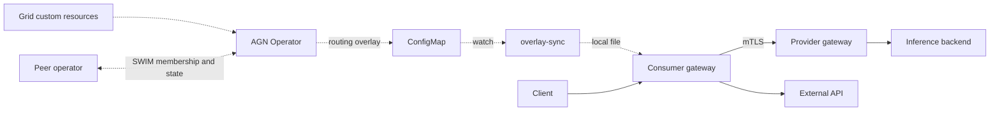

# AI Grid Network (AGN)

AI Grid Network (AGN) connects inference providers across Kubernetes clusters,
cloud services, and external APIs. Its operator discovers participating sites,
tracks provider availability, and publishes routing state for [Praxis AI]
gateways. Gateways select a provider for each request from that local state.

AGN is a technical preview. Start with the [scope and limitations] before
choosing a topology or planning an upgrade. You supply the clusters, inference
backends, credentials, gateway deployments, and connectivity between sites.

[Praxis AI]: https://github.com/praxis-proxy/ai
[scope and limitations]: docs/technical-preview-scope.md

## Architecture

The operator watches Kubernetes custom resources and exchanges membership and
provider state with peer operators over SWIM. It publishes a routing overlay in
a ConfigMap. The `overlay-sync` sidecar watches that ConfigMap and delivers a
file that the gateway can reload without restarting.



Dashed connections carry control-plane state. Solid connections carry inference
requests. The operator remains outside the request path. A consumer gateway can
call external APIs and non-private local backends directly. Private inference
requests must go through a provider gateway, even within the same site.
Provider credentials belong at the gateway making the final backend call;
overlays contain credential references, not tokens.

[Enrollment](charts/grid-enrollment/README.md) provides optional site-identity
bootstrap. The [fleet dashboard](fleet-dashboard/README.md) provides an optional
operational view. Neither component is required to understand the basic routing
path. See the [architecture overview](docs/architecture/overview.md) for the
controllers, trust lifecycle, signals, and deployment layouts.

## Choose a starting point

| Goal | Start here | What it creates or requires |
| --- | --- | --- |
| Exercise routing locally | [Single-cluster qualification][single-cluster] | One disposable kind cluster, an operator, two consumer gateways, three provider gateways, and attributed simulators. Requires Docker, kind, kubectl, Helm, OpenSSL, Rust, and the images/source described in the guide. |
| Install on existing clusters | [Existing-cluster installation][installation] | Separate operator and gateway Helm releases, site resources, and optional mock providers. Requires cluster contexts, connectivity, TLS material, and provider credentials. |
| Inspect a small external-API declaration | [Single-cluster API example][api-example] | Network, site, and provider manifests. Requires an installed operator, an API credential, and a separately configured gateway; the example alone does not route requests. |
| Explore complete demonstrations | [Praxis demos] | Scenario-specific deployments and runtime checks, maintained in a separate repository. |

[single-cluster]: tests/e2e/topologies/grid-single-cluster-multi-gateway/README.md
[installation]: docs/installation/existing-clusters.md
[api-example]: deploy/examples/single-cluster-api-provider/README.md
[Praxis demos]: https://github.com/praxis-proxy/demos

For a first routing check, follow the [single-cluster guide][single-cluster] to
prepare the images and validate its prerequisites, then run from this checkout:

```console
./scripts/forge.sh install
cargo xtask env run-grid-single-cluster-multi-gateway-qualification \
  --forge-config tests/e2e/topologies/grid-single-cluster-multi-gateway/forge.yaml
```

The runner sends inference requests and checks the serving overlay revisions,
provider attribution, provider withdrawal and recovery, consumer failure, and
network boundaries. It writes `results.json` and `SUMMARY.md` evidence and
attempts teardown automatically; `--keep` retains the environment for diagnosis.
Review the results and cleanup outcome. A successful single-site run establishes
local routing behavior; cross-site SWIM and WAN behavior need the multi-site
qualifications linked in the [documentation index](docs/README.md).

Installing only the `grid-operator` chart prepares the control plane. Use the
[installation guide][installation] to install compatible gateways as well. The
[operator chart](charts/grid-operator/README.md) documents CRD ownership,
retention, RBAC, and SWIM exposure; [deploy](deploy/README.md) covers Kustomize
and raw manifests.

## Routing concepts

- **`GridNetwork`** configures a logical mesh, discovery seeds, trust, and
  routing policy.
- **`GridSite`** records a participating site and the information needed to
  reach it. Discovery can create site records; discovery alone does not grant
  request-level authorization.
- **`InferenceProvider`** declares a backend, its models and capabilities,
  health configuration, and supported authentication strategy.
- **Routing overlays** describe eligible candidates, selection groups, and
  request-selection policy. Gateways serve requests from accepted local
  snapshots, including when the operator is temporarily unavailable.

Provider scoring uses one strategy selected by
`spec.scoringPolicy.strategy`:

| Strategy | Selection signal |
| --- | --- |
| `noMetrics` | Generic default for external APIs and providers without comparable telemetry. |
| `queueDepth` | Normalized queue depth; useful for compatible llm-d provider pools. |
| `kvCachePressure` | Available KV-cache capacity for compatible provider pools. |

Omitting the entire scoring policy selects `noMetrics`; when the policy is
present, its `strategy` is required. These strategies select provider pools.
Request-specific prefix affinity and pod selection remain inside llm-d EPP.
Model discovery uses provider-declared model capacity. Tool discovery probes
the configured MCP endpoint with `tools/list`; a non-empty `spec.tools`
filters those discovered names. AGN does not deploy models or provide a
tenant-facing catalog. See the
[routing guide](docs/routing.md) for selection modes, affinity, discovery, and
configuration examples. The [site-selection guide](docs/site-selection.md)
explains measured site availability and shedding at consumer gateways.

## Compatibility and trust

The API version is `grid.praxis.fast/v1alpha1`. Resources from the former
`grid.praxis-proxy.io` group require a fresh installation. Removing old CRDs
also removes their custom resources; review the
[operator chart's upgrade guidance] before changing an existing deployment.
AGN makes no general migration or mixed-version gossip compatibility guarantee
during the technical preview.

The `praxis-gateway` chart deploys the separately released Praxis AI image.
The `grid-gateway` binary in this repository is a separate operand with its own
Cargo workspace. Select images with the filters required by the deployment;
matching version numbers alone does not establish compatibility. The
[release guide](docs/release.md) distinguishes publication from consumer
qualification.

Gateway mTLS, site trust, external caller authorization, and backend credentials
serve separate purposes. SWIM encryption uses a shared mesh key; it does not by
itself bind a broadcast to a particular site's identity. The SWIM library has
origin-signature support, but the operator does not yet wire signing and origin
pins into its publication path. See [origin binding work] and the
[authentication guide](docs/architecture/auth.md). Routing and spend signals do
not constitute an authoritative billing record or a global quota guarantee.

[operator chart's upgrade guidance]: charts/grid-operator/README.md#upgrade
[origin binding work]: https://github.com/praxis-proxy/grid/issues/75

## Development

The root Rust workspace contains the operator, state and scoring libraries,
sidecars, and development tools. Gateway has a separate workspace and lockfile.
See the [development guide](docs/development.md) for the complete crate map,
tool versions, and local/CI gate boundaries.

```console
make build          # build the root workspace
make fmt            # format root and Gateway workspaces
make lint           # Clippy, formatting, dependencies, Gateway no-ring check
make test           # run root workspace tests
make all            # build, format, lint, docs, tests, audit
```

Install the pinned upstream Forge with `./scripts/forge.sh install` before
running environment qualifications. See [Forge tooling](docs/developing/forge.md)
for provenance, overrides, and upgrade checks.

Read [CONTRIBUTING](CONTRIBUTING.md) and the canonical
[development conventions](docs/conventions.md) before submitting a change.

## Documentation

- [Documentation index](docs/README.md)
- [Custom resources](docs/architecture/crds.md)
- [Routing and overlay contract](docs/architecture/routing.md)
- [Scoring](docs/architecture/scoring.md)
- [Authentication and access policy](docs/architecture/auth.md)
- [Operations and troubleshooting](docs/architecture/operations.md)
- [Security reporting](SECURITY.md)
- [Apache-2.0 license](LICENSE)
