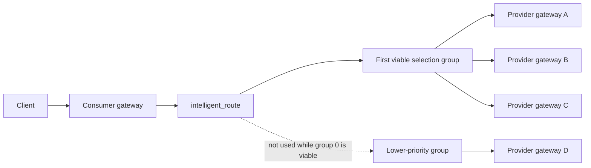
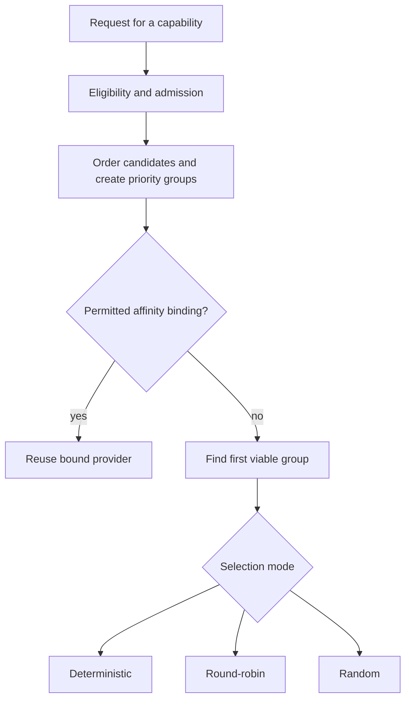
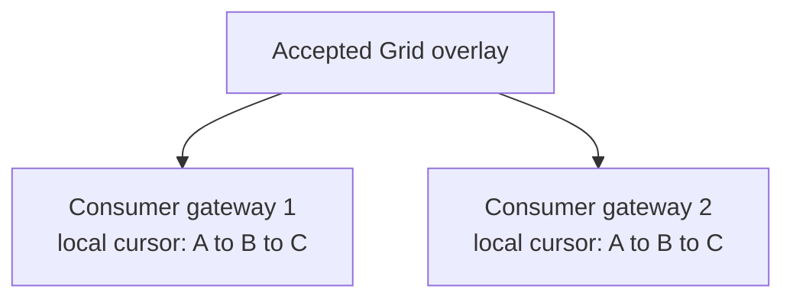
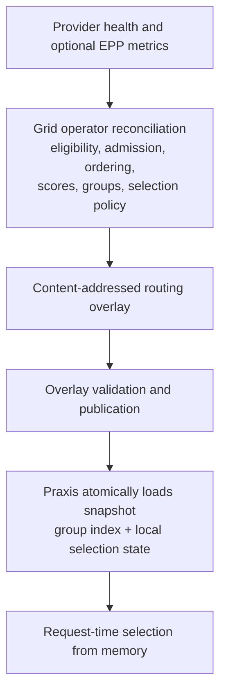

# Provider Selection and Load Balancing

Grid and Praxis divide provider routing into two parts:

- Grid observes provider state asynchronously, decides which providers are
  eligible, orders them, and publishes a versioned routing overlay.
- Praxis consumes that overlay and makes the final request-time choice locally
  in the `intelligent_route` filter.

This separation keeps Kubernetes, Grid reconciliation, EPP metrics, and remote
coordination out of the request hot path.



A, B, and C can share active traffic when the selected policy permits it. D is
fallback capacity and is not selected while the earlier group remains viable.
A selection group is a priority and resilience boundary; it is not a score
bucket and does not represent a traffic percentage.

This layer balances requests across provider gateways. After a provider gateway
is selected, its local serving stack can make a separate backend-level decision.
For example, an llm-d provider gateway can delegate endpoint selection to EPP.
Grid does not use round-robin to choose individual inference replicas hidden
behind one provider gateway.

## Choose a configuration

Use these starting points, then adjust them to match the deployment's routing
goal:

| Goal | Routing policy | Scoring strategy | Selection mode |
|---|---|---|---|
| Share traffic across nearby generic providers | `geographyFirst` | `noMetrics` | `roundRobin` |
| Keep nearby providers active and remote providers as fallback | `geographyFirst` | Any | `roundRobin` |
| Send new traffic to the highest-ranked provider | `geographyFirst` or `scoreFirst` | Any | `deterministic` |
| Share traffic across sites without inference metrics | `scoreFirst` | `noMetrics` | `roundRobin` |
| Randomize selection inside the preferred provider group | Either | Any | `random` |

The three policy fields answer different questions:

- `routingPolicy`: Which providers belong in the same active or fallback group?
- `scoringPolicy`: How should providers be ranked using available metrics?
- `selectionPolicy`: How should Praxis choose within the active group?

## The decision sequence



Scores contribute to candidate ordering. They do not create groups. The
selection mode operates only inside the first group that can serve the request.

## Eligibility and admission

Before ordering, Grid builds candidates for the requested capability. The
overlay already reflects capability matching, authorization and trust,
provider health, freshness, and provider availability. Admission is a hard
boundary:

| Admission state | New requests | Existing sessions |
|---|---:|---:|
| `newAndExisting` | Allowed | Allowed |
| `existingOnly` | Not selected | Allowed when the binding is permitted |
| `excluded` | Not selected | Not selected |

An `existingOnly` provider can finish work for a session that is already bound
to it, but it does not receive new bindings. An excluded provider cannot be
selected. Neither scoring nor a selection mode can override these states.

## Routing policy and groups

`spec.routingPolicy` controls candidate ordering and hard priority boundaries.
The supported values are `geographyFirst` and `scoreFirst`.

### `geographyFirst`

Candidates are ordered by admission, locality tier, freshness, score, and
deterministic identity tie-breakers. Groups are separated by admission,
locality tier, and freshness. Scores order candidates within a group but do
not split that group.

```text
Closest healthy and fresh tier:  A, B, C  <- active selection
More distant healthy tier:      D, E     <- fallback
```

In plain language: balance within the closest healthy provider tier and use
more distant capacity as fallback. A remote provider does not join local
active traffic merely because its score is higher.

### `scoreFirst`

Candidates are ordered by admission, freshness, score, locality, and
deterministic identity tie-breakers. Groups are separated by admission and
freshness only. Fresh admitted providers from different sites can therefore
share one active group. Score differences affect order, not group membership.

In plain language: allow fresh admitted providers across sites to participate
in the same active traffic group.

## Scoring policy

`spec.scoringPolicy.strategy` selects the provider-level signal used for score
calculation. It is independent of request-time selection:

- `noMetrics` requires no EPP, Prometheus, or inference-specific metrics.
  Dynamic score contributions are zero, while health, admission, freshness,
  authorization, locality, affinity, and selection policy still apply. This is
  the normal choice for generic or heterogeneous provider gateways. Use it when
  llm-d EPP metrics are unavailable or are not comparable across providers.
- `queueDepth` uses asynchronously observed, normalized provider-pool queue
  pressure. Lower pressure produces a higher preference score. It requires
  comparable queue metrics and a meaningful queue capacity. For an llm-d
  provider, Grid retrieves this signal from the configured EPP metrics endpoint.
- `kvCachePressure` uses provider-level KV-cache utilization as a capacity
  pressure signal. Lower utilization produces a higher score. It is not
  request-specific prefix-cache affinity; that decision belongs inside the
  inference scheduler. For an llm-d provider, Grid retrieves this signal from
  the configured EPP metrics endpoint.

Grid currently uses one explicitly selected strategy rather than blending
unrelated signals into an opaque total. Missing local samples can use the
implementation's neutral fallback values, and a recent local sample can be
reused while it remains within `staleMetricsSeconds`. Deployments using a
metric strategy should provide fresh, comparable telemetry for every competing
provider.

The important rule is:

```text
score != traffic weight
```

Scores are preference and observability signals. They do not turn a score of
`0.8` versus `0.4` into a 2:1 traffic split. With `roundRobin`, candidates in
the active group receive equal turns regardless of their scores.

For detailed metric input and normalization, see [Provider Scoring](scoring.md).

## Selection policy

`spec.selectionPolicy.mode` controls request-time selection inside the first
viable group. The selection mode is applied from an accepted in-memory
snapshot by Praxis; Grid is not called for each request.

- **`deterministic`** selects the first provider after Grid has ordered the
  active group. Use it for strict preference or primary/fallback routing.
- **`roundRobin`** takes equal turns across the active group. Use it for a
  predictable, even sequence of selections.
- **`random`** gives every provider in the active group an equal chance. Use it
  when a repeating sequence is unnecessary.
- **`weightedRandom`** gives providers different chances based on configured
  relative capacity. Use it when providers should receive unequal shares.

### `deterministic`

Selects the first viable candidate in the active group. This is strict
preference behavior: Grid's ordering determines which provider receives new
unbound traffic. It is useful when locality, score, primary/standby order, or
predictability should dominate. When `selectionPolicy` is absent from an
overlay, Praxis uses `deterministic`.

```yaml
spec:
  routingPolicy: geographyFirst
  scoringPolicy:
    strategy: noMetrics
  selectionPolicy:
    mode: deterministic
```

### `roundRobin`

Takes equal turns across viable candidates in the active group. It does not
require inference metrics and does not distribute across lower-priority groups
while the active group is viable. It balances selections, not necessarily
tokens, latency, request cost, or concurrent work. Session affinity is checked
before this mode runs.

```yaml
spec:
  routingPolicy: geographyFirst
  scoringPolicy:
    strategy: noMetrics
  selectionPolicy:
    mode: roundRobin
```

### `random`

Selects uniformly from viable candidates in the active group. It follows the
same admission, group, and affinity rules as round-robin. Random state is local
to the gateway process and is not a global coordinator.

```yaml
spec:
  routingPolicy: geographyFirst
  scoringPolicy:
    strategy: noMetrics
  selectionPolicy:
    mode: random
```

### `weightedRandom`

Selects new, unbound requests proportionally using each candidate's explicit
static `traffic_weight`. It is valid only with `placementPolicy.strategy:
static`; the weights originate from `InferenceProvider.spec.capacityWeight`
and are not inferred from scores or live metrics. Eligibility, affinity, and
group precedence are unchanged: Praxis checks a permitted affinity binding
first, finds the first viable group, and applies weights only within that
group.

```yaml
spec:
  routingPolicy: geographyFirst
  scoringPolicy:
    strategy: noMetrics
  selectionPolicy:
    mode: weightedRandom
  placementPolicy:
    strategy: static
```

Each provider supplies its relative capacity separately:

```yaml
apiVersion: grid.praxis-proxy.io/v1alpha1
kind: InferenceProvider
metadata:
  name: provider-a
spec:
  capacityWeight: 50
```

With `geographyFirst`, a high-weight remote provider remains fallback while a
closer group is viable. With `scoreFirst`, eligible providers across sites can
share the active group and their relative weights participate together. See
[Static provider weighting](static-weighting.md) for the complete contract.

## Policy matrix

| Routing policy | Selection policy | Effective behavior |
|---|---|---|
| `geographyFirst` | `deterministic` | Strict preference for the highest-ranked provider in the closest viable tier |
| `geographyFirst` | `roundRobin` | Equal selection in the closest viable tier; remote tiers are fallback |
| `geographyFirst` | `random` | Uniform selection in the closest viable tier |
| `geographyFirst` | `weightedRandom` | Weighted selection in the closest viable tier; remote tiers are fallback |
| `scoreFirst` | `deterministic` | Strict preference for the highest-ranked fresh admitted provider across sites |
| `scoreFirst` | `roundRobin` | Equal selection across fresh admitted providers in the active group |
| `scoreFirst` | `random` | Uniform selection across fresh admitted providers in the active group |
| `scoreFirst` | `weightedRandom` | Weighted selection across fresh admitted providers in the active group |

The scoring strategy changes ordering, not the selection mode:

| Scoring strategy | Metrics required | Deterministic | Round-robin |
|---|---|---|---|
| `noMetrics` | No | Ordering and deterministic tie-breaks decide | Equal selection inside the active group |
| `queueDepth` | Compatible queue metrics | Highest queue-based preference is first | Scores remain visible; selection remains equal |
| `kvCachePressure` | Compatible KV metrics | Highest available-capacity preference is first | Scores remain visible; selection remains equal |

## Configuration examples

### Generic provider-gateway balancing

```yaml
apiVersion: grid.praxis-proxy.io/v1alpha1
kind: GridNetwork
metadata:
  name: provider-grid
spec:
  routingPolicy: geographyFirst
  scoringPolicy:
    strategy: noMetrics
  selectionPolicy:
    mode: roundRobin
```

Providers in the nearest viable group share selections equally. No inference
metrics are required, and remote groups remain available for fallback.

### Strict metric preference

```yaml
apiVersion: grid.praxis-proxy.io/v1alpha1
kind: GridNetwork
metadata:
  name: inference-grid
spec:
  routingPolicy: scoreFirst
  scoringPolicy:
    strategy: queueDepth
  selectionPolicy:
    mode: deterministic
  metricsRefreshInterval: "10s"
```

Grid refreshes the selected signal asynchronously. Deterministic selection
uses the resulting ordering; it does not query EPP during a request.

### Cross-site active/active selection

```yaml
apiVersion: grid.praxis-proxy.io/v1alpha1
kind: GridNetwork
metadata:
  name: active-active-grid
spec:
  routingPolicy: scoreFirst
  scoringPolicy:
    strategy: noMetrics
  selectionPolicy:
    mode: roundRobin
```

Fresh, admitted providers from multiple sites can share the active group.

### Random selection

```yaml
apiVersion: grid.praxis-proxy.io/v1alpha1
kind: GridNetwork
metadata:
  name: random-provider-grid
spec:
  routingPolicy: geographyFirst
  scoringPolicy:
    strategy: noMetrics
  selectionPolicy:
    mode: random
```

Random selection is uniform within the active group. It is useful when an
equal probabilistic distribution is sufficient and a repeating sequence is not
required.

## Request-time behavior and affinity

For a new request, Praxis reads the accepted snapshot, resolves the requested
capability, checks affinity, finds the first viable group, applies the selection mode,
and records a binding when the selection succeeds.

```text
Client
  |
  | request
  v
Consumer gateway / intelligent_route
  | 1. Read accepted in-memory overlay
  | 2. Resolve capability and eligibility
  | 3. Check session affinity
  | 4. Find the first viable group
  | 5. Apply the configured selection mode
  | 6. Record the successful binding
  v
Selected provider gateway
  |
  v
Provider backend
```

For an existing permitted binding, no new selection mode is applied:

```text
Client with an existing session
  |
  v
intelligent_route
  |
  | permitted affinity binding found
  v
Previously selected provider
```

Round-robin does not move an established session just to improve aggregate
balance. The observed request distribution can therefore differ from an exact
split when sessions generate different amounts of traffic.

## Multiple consumer gateways

The design supports multiple consumer gateways. Each gateway receives an
accepted overlay snapshot and keeps its own local selection state:



Counters are not coordinated globally. Each gateway can produce a balanced
local sequence, while aggregate traffic depends on request rates, affinity,
restarts, and snapshot replacement. A globally synchronized quota would need
a different coordination design and would add hot-path trade-offs.

## Overlay lifecycle and re-ranking



Reconciliation is triggered by watched provider, site, and network changes,
remote Grid state, and the periodic `metricsRefreshInterval`. The default
periodic cadence is 300 seconds for plaintext metrics; TLS-protected metrics
use a 60-second safety cap. A configured interval must be at least one second.
The interval controls observation and overlay publication, not request-path
latency. An operator can cause an earlier reconcile through a real watched
resource change.

After an overlay is accepted, requests do not call Grid, Kubernetes,
ConfigMaps, EPP, Prometheus, or a remote scoring service. An unchanged semantic
revision should not continually rebuild selection state. An accepted semantic
change may create fresh snapshot-scoped state.

## Failure and fallback

Grid observes health, admission, freshness, and optional metrics
asynchronously. Praxis serves from the last accepted snapshot until a valid
new overlay is delivered. An unavailable or excluded provider cannot receive
new selections, and the first viable group is preferred. Later groups are
fallback capacity, not part of normal active distribution.

Failover is therefore bounded by observation, reconciliation, overlay
distribution, and snapshot acceptance. It is not an immediate request-time
call to Grid. A request already sent upstream can fail before a newer snapshot
is accepted; do not assume automatic retry unless the gateway configuration
explicitly provides it.

## Overlay contract and static weighting

`selectionPolicy` is optional in both the Grid API and the overlay. An omitted
field remains omitted, and Praxis interprets it as deterministic selection.
The Helm chart explicitly renders `roundRobin` by default. Users applying a
`GridNetwork` directly can either set the selection mode explicitly or omit the policy
to select `deterministic`.

`selection_group` and `selection_policy` are part of the semantic digest when
present. Group numbers are zero-based and contiguous per capability. Unknown
mode values and malformed policy structures are rejected. Overlays without
the optional selection fields remain valid and use deterministic selection.

The provider ordering used to construct groups is also part of the routing
contract. In particular, the updated `geographyFirst` ordering evaluates
freshness before score after locality. Existing resources that omit
`selectionPolicy` still use deterministic selection, but an upgrade can change
which provider is first when candidates differ in freshness. Deployments that
require a fixed primary provider should set their routing and selection policy
explicitly and validate the resulting overlay during upgrade.

Static weighted selection is explicit and opt-in. `weightedRandom` requires a
static placement policy, and Grid publishes the configured provider capacity as
a bounded relative `traffic_weight`. It is not inferred from score, rank,
metric presence, or candidate count, and it does not change admission,
locality, authorization, freshness, affinity, or group boundaries. Dynamic
metric-based weighting remains a separate follow-up built on this selection
foundation.
