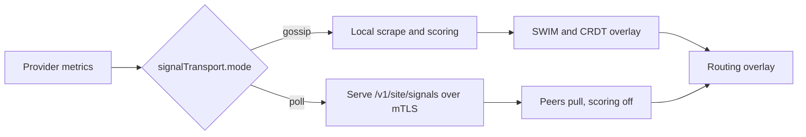

# Signal propagation

Signals are the provider load a site observes, such as queue depth and KV-cache
pressure. `signalTransport` on the `GridNetwork` selects, grid-wide, how they
cross sites. It names the dissemination path, not the transport: SWIM membership
runs either way and only where the load signal travels changes, which is why the
modes are `gossip` and `poll` rather than `swim`.



```yaml
signalTransport:
  mode: poll
```

`gossip` is the established path: each site scrapes and scores locally and the
samples ride the SWIM and CRDT overlay. `poll` instead serves the scraped
signals on a mutual-TLS `/v1/site/signals` endpoint, polls peers, and turns
local scoring off so the gateway ranks from what it pulls. A peer's poll URL is
its SWIM-advertised host at the signals port, so a reachable member is a
reachable signals endpoint.

The field is optional. Absent, the grid gossips, so existing deployments are
unaffected. The mode is read once at operator start, so changing it is a
restart, not a live flip, which keeps the mTLS listener bound only under `poll`.
While a `GridNetwork` spec and the resolved mode disagree, the reconcile warns
and names both, so a fresh-install race is visible rather than silent.

At Tech Preview one operator serves one `GridNetwork`, and it fails to start on
more than one rather than pick a mode for the process-global serve and poll
paths. A reader treats a missing signal as neutral, not zero, per the signal
mapping reference.
