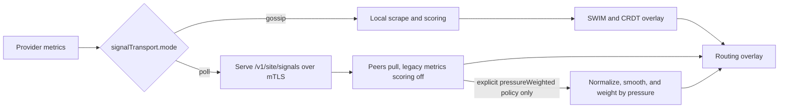

# Signal propagation

Signals are the provider load a site observes, such as queue depth and KV-cache
pressure. `signalTransport` on the `GridNetwork` selects, grid-wide, how they
cross sites. It names the dissemination path, not the transport: SWIM membership
runs either way and only where the load signal travels changes, which is why the
modes are `gossip` and `poll` rather than `swim`.


```mermaid
flowchart LR
  P[Provider metrics] --> M{signalTransport.mode}
  M -->|gossip| G[Local scrape and scoring] --> C[SWIM and CRDT overlay] --> O[Routing overlay]
  M -->|poll| S[Serve /v1/site/signals over mTLS] --> D[Peers pull, legacy metrics scoring off]
  D --> O[Routing overlay]
  D -->|explicit pressureWeighted policy only| W[Normalize, smooth, and weight by pressure]
  W --> O
```

```yaml
signalTransport:
  mode: poll
```

`gossip` is the established path: each site scrapes and scores locally and the
samples ride the SWIM and CRDT overlay. `poll` instead serves the scraped
signals on a mutual-TLS `/v1/site/signals` endpoint and polls peers. Poll mode
turns off the legacy metrics-to-score path; by itself it does not produce
pressure-based routing weights. A peer's poll URL is its SWIM-advertised host
at the signals port, so a reachable member is a reachable signals endpoint.

The field is optional. Absent, the grid gossips, so existing deployments are
unaffected. The mode is read once at operator start, so changing it is a
restart, not a live flip, which keeps the mTLS listener bound only under `poll`.
When a `GridNetwork` declares another mode than the running one, for example
one created after the operator started, the operator exits so Kubernetes
restarts it into the declared mode. Only the poll path restarts on a peer trust
change, so a trust change under `gossip` does not restart it. Certificate rotation
reads the declared trust on every check, so under `gossip` a switch to `pin` stops
it without a restart. Under `poll` the same change restarts the operator.

At Tech Preview one operator serves one `GridNetwork`, and it fails to start on
more than one rather than pick a mode for the process-global serve and poll
paths. A reader treats a missing signal as neutral, not zero, per the signal
mapping reference.

## Experimental pressure-weighted placement

Pressure can affect traffic shares only when explicitly enabled with
`selectionPolicy.mode: weightedRandom` and
`placementPolicy.strategy: pressureWeighted`. This is separate from scoring:
Grid continues to form eligibility and selection groups first, then publishes
positive `trafficWeight` values within each group. Pressure changes those
weights; it does not turn a score or rank into a probability. Praxis AI applies
the weights to new, unbound requests in the first eligible group, while a valid
affinity binding continues to take precedence.

The policy requires `signalTransport.mode: poll` and selects a normalized
queue-depth or KV-cache signal:

```yaml
signalTransport:
  mode: poll
selectionPolicy:
  mode: weightedRandom
placementPolicy:
  strategy: pressureWeighted
  pressureWeighted:
    signal: queueDepth
    smoothingFactor: 0.35
    staleSignalSeconds: 120
```

Grid normalizes queue depth using the provider's configured pool and queue
capacity, scopes observations by their originating site and provider identity,
and bounds their age before calculating weights. Missing, stale, conflicting,
or invalid pressure removes only the affected candidate from the next overlay;
other candidates and provider-state changes can still publish. A missing
signal is never treated as zero pressure. If no candidate has a usable signal,
Grid distributes an empty `weightedRandom` overlay as an explicit
no-provider-eligible state. Praxis AI accepts that state, advances its serving
revision, and rejects new model requests with HTTP 404 until an eligible
candidate is published again. Empty candidate lists in other selection modes
remain invalid. This policy is experimental; the deterministic
pressure/recovery qualification is documented in the
[llm-d pool-metrics topology](../../tests/e2e/topologies/grid-llmd-pool-metrics/README.md).

Pressure telemetry and health are different signals. A missing queue or
KV-cache observation means Grid cannot calculate a trustworthy dynamic weight
for that provider; it does **not** mean its pod, node, or site has failed. Grid
omits that candidate from new pressure-weighted routing, while provider health
and SWIM membership continue to determine whether the provider or site is
actually unavailable. If every pressure observation is missing, the empty
overlay rejects new model requests; it does not mark every site failed. An
availability fallback based on static capacity would require an explicit
policy and independent health checks, not an implicit reuse of old weights.
