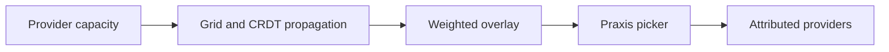
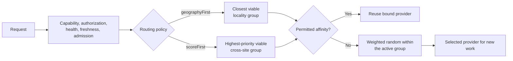

# Static provider weighting

Static weighting publishes relative provider capacity to Praxis. Weights such
as `50/30/20` are relative, not percentages or request guarantees, and are
sampled statistically among candidates in the first eligible selection group.



```yaml
selectionPolicy:
  mode: weightedRandom
placementPolicy:
  strategy: static
```

`capacityWeight` is an integer from 1 through 1000. Grid publishes that value
directly as the relative overlay `traffic_weight`; it does not multiply or
normalize it. Thus equivalent ratios have equivalent selection probabilities.
Static weights do not override routing precedence. Grid first removes candidates
that fail capability, authorization, trust, health, freshness, or admission
requirements. The routing policy then forms priority groups: `geographyFirst`
keeps the closest viable locality tier active and treats more distant tiers as
fallback, while `scoreFirst` can place fresh admitted providers from different
sites in the same active group. Praxis checks a permitted session-affinity
binding before using `weightedRandom` for a new, unbound request. The weights
apply only among candidates in that first viable group.



A large remote weight therefore cannot pull traffic out of a healthy local
group when `geographyFirst` is configured. It participates only when it belongs
to the active group or when higher-priority groups have no viable candidate.
Static weighting does not react to queue depth, KV-cache pressure, or metrics.
Dynamic metric-based adjustment is a separate follow-up.

The qualification samples 60 requests per phase and uses a Pearson chi-square
goodness-of-fit test with two degrees of freedom and critical value `5.991` at
`alpha = 0.05`. Evidence is written beneath the topology's ignored
`evidence/<run-id>/` directory.
