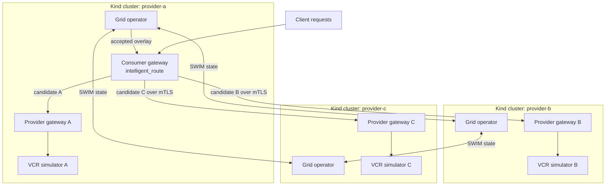
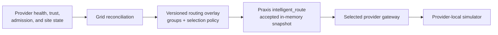
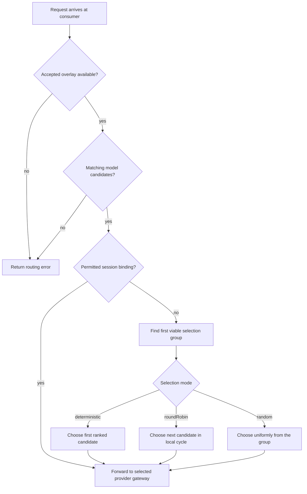
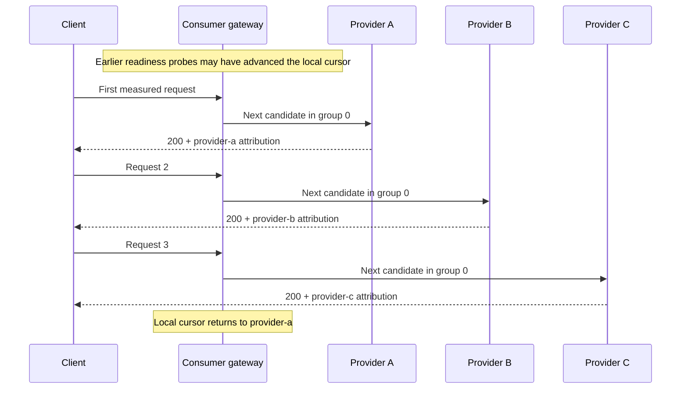

# Provider Traffic Selection

This topology demonstrates Grid publishing a provider-selection contract and Praxis applying that contract locally for each request. It creates three Kind clusters, three independently attributable provider gateways, and one consumer gateway.

The focused proof sends 60 requests without session affinity. With
`selectionPolicy.mode: roundRobin`, the expected result is a repeating
three-provider cycle and exactly 20 responses from each provider. The first
measured request can use any provider because readiness probes may already have
advanced the gateway-local cursor.

This scenario tests provider selection across Grid sites. It does not test load balancing among replicas hidden behind one provider gateway, distributed token quotas, or cloud bursting.

## Topology



Only `provider-a` runs a consumer gateway. Every cluster runs a Grid operator, a provider gateway, and a VCR inference simulator. SWIM distributes provider state between the operators. Each operator reconciles that state into a versioned overlay; the consumer uses its local accepted copy.

## Who makes each decision?



Grid decides which candidates are eligible, their priority group, and the selection policy published in the overlay. Praxis chooses a candidate at request time from that already-accepted snapshot. Requests do not call Grid, Kubernetes, SWIM, or a metrics service.

The provider gateway then resolves its configured local backend. That is a separate routing boundary: Grid selects provider gateways, not individual inference replicas hidden behind them.

## Request decision flow



The proof uses unbound requests so session affinity cannot pin the sequence to one provider. All three candidates are fresh, admitted, and assigned to `selection_group: 0`.

## Configuration

The topology configures the Grid network with an explicit policy:

```yaml
gridNetwork:
  name: grid-provider-traffic
  routingPolicy: scoreFirst
  scoringPolicy:
    strategy: noMetrics
  selectionPolicy:
    mode: roundRobin
```

`scoreFirst` with `noMetrics` puts the three fresh, admitted providers in the same active group. `roundRobin` then gives each candidate an equal turn. Scores are not weights, and lower-priority groups do not participate while this group remains viable.

The complete environment is in [`forge.yaml`](./forge.yaml). Supporting files are intentionally local to this topology:

| Path | Purpose |
|---|---|
| [`configs/consumer/praxis.yaml`](./configs/consumer/praxis.yaml) | Consumer filter chain, accepted overlay, provider-hop clusters, and mTLS endpoints |
| [`configs/provider/praxis.yaml`](./configs/provider/praxis.yaml) | Provider identity validation, exact candidate routing, credential injection, and response attribution |
| [`resources/common/vcr-provider-workload.yaml`](./resources/common/vcr-provider-workload.yaml) | One attributed VCR backend per provider cluster |
| [`resources/common/backend-network-policy.yaml`](./resources/common/backend-network-policy.yaml) | Restricts backend access to the provider gateway |

## Run the proof

Prerequisites include Docker, Kind, `kubectl`, Helm, OpenSSL, and `praxis-forge`. Build the Grid operator and Praxis AI gateway images before using the default `Never` pull policy.

Build `praxis-forge` and the two source images from clean Grid and AI checkouts:

```console
# From the Grid repository.
cargo build -p forge
docker build -f deploy/operator/Containerfile \
  -t grid-operator:provider-traffic-qualification .

# From the Praxis AI repository.
docker build -f Containerfile \
  -t praxis-ai:provider-traffic-qualification .
```

The Forge binary is written to `target/debug/praxis-forge`. Add that directory
to `PATH` or invoke the binary by its full path. Verify the environment before
creating clusters:

```console
target/debug/praxis-forge config validate \
  --config tests/e2e/topologies/grid-provider-traffic/forge.yaml
cargo test -p xtask provider_traffic --locked
```

```console
export GRID_XTASK_OPERATOR_IMAGE=grid-operator:provider-traffic-qualification
export GRID_XTASK_GATEWAY_IMAGE=praxis-ai:provider-traffic-qualification
export GRID_XTASK_SIM_IMAGE=ghcr.io/neuralmagic/vllm-vcr:vllm0.23
export GRID_XTASK_IMAGE_PULL_POLICY=Never

cargo xtask env run-grid-provider-traffic-qualification \
  --forge-config tests/e2e/topologies/grid-provider-traffic/forge.yaml \
  --full \
  --teardown
```

The provider-traffic qualification has one complete six-scenario proof set.
Use `--full` for release qualification; `--quick` remains available for the
same focused proof when a bounded diagnostic run is preferred.

For registry-hosted images, use immutable tags or digests and set
`GRID_XTASK_IMAGE_PULL_POLICY=IfNotPresent`. Do not reuse evidence from a run
that used different source commits or image digests.

## Expected result

A qualifying run demonstrates:

- three Kind clusters become healthy;
- SWIM discovers and authorizes the remote sites;
- the accepted overlay contains three stable provider candidates;
- every candidate is in selection group `0`;
- the overlay publishes `selection_policy.mode: roundRobin`;
- all 60 requests return successfully;
- attribution follows a rotation-equivalent three-provider cycle, such as
  `provider-a`, `provider-b`, `provider-c` or `provider-b`, `provider-c`,
  `provider-a`;
- each provider serves exactly 20 requests;
- the semantic overlay revision remains stable during traffic;
- teardown removes the clusters and shared network.

Provider identity comes from request-scoped HTTP response attribution, not only
from logs or expected configuration. A balanced count without a repeating
ordered cycle is insufficient for the strict round-robin proof. The cycle's
starting provider is not significant.

## Example sequence



## Troubleshooting

| Symptom | Check |
|---|---|
| Forge stops before cluster creation | Validate `forge.yaml` and confirm `praxis-forge` is installed |
| A local image is missing | Build the configured tag or use registry images with a pull-enabled policy |
| Only one provider receives traffic | Confirm requests have no reusable session ID and all candidates are in group `0` |
| Remote providers do not appear | Check SWIM addresses, discovered `GridSite` resources, fingerprints, and trust authorization |
| A provider rejects the request | Check candidate stable ID, model/path validation, mTLS identity, and credential mounting |
| Counts are balanced but not cyclic | Confirm `roundRobin`, a stable overlay, and one consumer process for the measured sequence; any rotation of A/B/C is valid |
| A request hangs | Preserve the failure; do not discard or silently retry it |

## Related documentation

- [Round-robin selection in the Grid Routing Guide](../../../../docs/routing.md#3-round-robin-selection)
- [Routing](../../../../docs/architecture/routing.md)
- [Provider Scoring](../../../../docs/architecture/scoring.md)
- [Consumer Config](../../../../docs/architecture/consumer-config.md)
