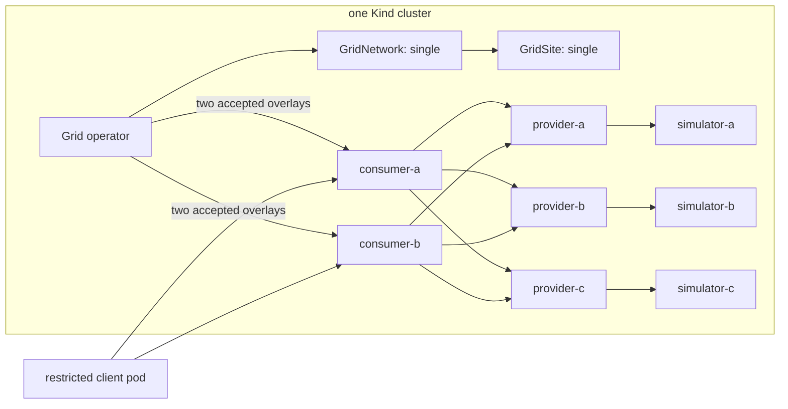
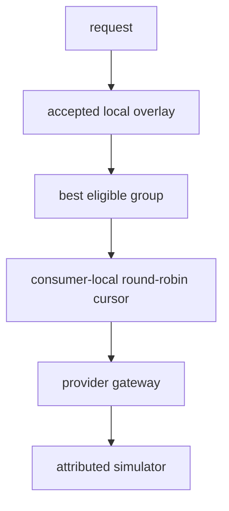

# Single-cluster multi-gateway qualification

This qualification keeps one Kubernetes control plane and one Grid site while
running two independent consumer gateways, three independent provider gateways,
and one attributed simulator per provider. It complements the multi-cluster
provider-traffic qualification: this topology exercises shared Kubernetes and
overlay state, but it does not claim WAN SWIM or cross-cluster network behavior.

More precisely, this topology contains one Kubernetes cluster, one Grid
operator, one GridNetwork, and one GridSite named `single`. Multiple consumer
and provider gateway processes share that site and its generated routing state.





Round-robin state is process-local. The qualification therefore checks a valid
balanced rotation independently through each consumer and does not require one
global interleaved sequence. Grid publishes eligibility, groups, and policy;
Praxis selects from its already-loaded local snapshot on the request path.

## Health convergence

This is a single-site qualification, so the Grid operator relies on its direct
provider health checks rather than multi-site SWIM failure detection. The
topology sets each provider's `healthCheck.interval` to `10s`, instead of the
`30s` production default, to make local provider withdrawal and recovery
convergence observable within the qualification run. This is a test-topology
tuning example; it does not change the operator's production default.

## Configuration

The topology sets `selectionPolicy.mode: roundRobin` and publishes the three
providers in the same eligible selection group. Both consumers receive their
own generated overlay and maintain an independent request-selection cursor.

| Path | Purpose |
|---|---|
| [`forge.yaml`](./forge.yaml) | One-cluster Forge environment and ordered stack definitions |
| [`configs/consumer/`](./configs/consumer/) | Consumer filter chains and provider-hop clusters |
| [`configs/provider/`](./configs/provider/) | Provider routes and trusted response attribution |
| [`resources/common/`](./resources/common/) | VCR simulators, restricted client, namespace, and NetworkPolicy |

The Forge environment retains `crossCluster: true` because Forge uses that
network mode to allocate MetalLB addresses reachable by the host-side test
orchestrator. It still creates exactly one Kubernetes cluster and does not test
cross-cluster discovery.

## Run the qualification

Prerequisites are Docker, Kind, `kubectl`, Helm, OpenSSL, Rust, and an AI source
checkout next to or otherwise accessible from this Grid checkout. The runner
uses `imagePullPolicy: Never` by default. The names below are local-development
defaults; release validation should provide unique references through the
`GRID_XTASK_*_IMAGE` environment variables:

- `grid-operator:single-cluster-qualification`
- `grid-overlay-sync:single-cluster-qualification`
- `praxis-ai:single-cluster-qualification`
- `ghcr.io/neuralmagic/vllm-vcr:vllm0.23`

Supported overrides are `GRID_XTASK_GATEWAY_IMAGE`,
`GRID_XTASK_OPERATOR_IMAGE`, `GRID_XTASK_OVERLAY_SYNC_IMAGE`,
`GRID_XTASK_SIM_IMAGE`, and `GRID_XTASK_IMAGE_PULL_POLICY`. Explicit image
references are materialized into the Forge configuration, loaded into Kind
when the policy is `Never`, and recorded in qualification evidence. The runner
fails before deployment if an explicit reference is malformed, missing, or
absent from the materialized configuration.

Build Forge and the Grid images from this checkout:

```console
cargo build -p forge

export GRID_XTASK_GATEWAY_IMAGE=praxis-ai:single-cluster-qualification-$RUN_ID
export GRID_XTASK_OPERATOR_IMAGE=grid-operator:single-cluster-qualification-$RUN_ID
export GRID_XTASK_OVERLAY_SYNC_IMAGE=grid-overlay-sync:single-cluster-qualification-$RUN_ID
export GRID_XTASK_SIM_IMAGE=ghcr.io/neuralmagic/vllm-vcr:vllm0.23
export GRID_XTASK_IMAGE_PULL_POLICY=Never

docker build -f deploy/operator/Containerfile \
  -t "$GRID_XTASK_OPERATOR_IMAGE" .

docker build -f overlay-sync/Containerfile \
  -t "$GRID_XTASK_OVERLAY_SYNC_IMAGE" .
```

Build the gateway from a clean Praxis AI checkout. This qualification uses the
standard provider-selection path and does not require the optional distributed
quota filters:

```console
docker build -f Containerfile \
  -t "$GRID_XTASK_GATEWAY_IMAGE" .
```

Pull the pinned simulator image, validate the topology, and run focused static
tests before creating the cluster:

```console
docker pull ghcr.io/neuralmagic/vllm-vcr:vllm0.23

target/debug/praxis-forge \
  --config tests/e2e/topologies/grid-single-cluster-multi-gateway/forge.yaml \
  config validate

cargo test -p xtask single_cluster_multi_gateway --locked
```

Run the qualification from the Grid repository root:

```console
cargo xtask env run-grid-single-cluster-multi-gateway-qualification \
  --forge-config tests/e2e/topologies/grid-single-cluster-multi-gateway/forge.yaml
```

Use `--keep` only for bounded diagnosis; it intentionally leaves the created
cluster running. Use `--evidence-dir PATH` to place evidence somewhere other
than the ignored topology-local `evidence/` directory.

## Expected result

A passing run proves that:

- every required image is present in the Kind node before stack application;
- all stacks and Deployments reach their observed generations;
- both consumers receive the same three-candidate Grid overlay;
- each consumer's accepted and serving revisions match the Grid revision;
- each consumer independently follows the attributed A/B/C rotation;
- removing provider B's backend withdraws B from both accepted overlays and
  new traffic continues through A and C;
- restoring provider B returns it to both overlays;
- consumer B continues serving while consumer A is unavailable, and consumer A
  serves again after recovery;
- concurrent requests retain trusted attribution and collectively reach all
  three providers; and
- the restricted client can use the consumer path but cannot connect directly
  to a protected inference backend.

The runner writes timestamped `results.json` and `SUMMARY.md` files. Generated
evidence is ignored by Git and must not be committed. It uses bounded
subprocesses, JSON resource reads, observed-generation readiness, and automatic
Forge teardown. It never edits an accepted overlay directly.

## Scope

This qualification proves multiple independent gateway processes inside one
Kubernetes cluster and one Grid site. It does not prove WAN connectivity, SWIM
membership between sites, a single globally coordinated round-robin cursor, or
load balancing among replicas hidden behind one provider gateway. Use the
multi-cluster provider-traffic qualification for cross-site discovery and
routing.

The checked-in qualification must remain honest about the distinction between
bootstrap evidence and request-path evidence. A run is not successful unless
overlay/serving revision barriers, provider attribution, withdrawal/restoration,
consumer failure, and positive/negative security probes all pass.
