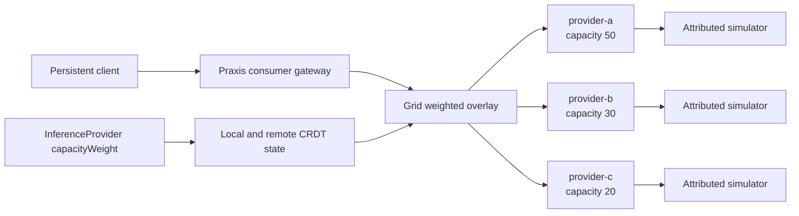
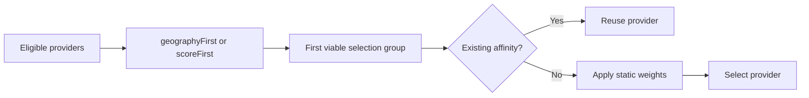

# Static weighted provider qualification

This isolated three-site Forge topology qualifies operator-configured relative
provider capacity without changing the ordinary `grid-provider-traffic`
round-robin qualification. Static weighting is not queue-depth, KV-cache, or
other live-metric routing: it has no scraping, normalization, smoothing,
hysteresis, availability floor, or recovery timer.



Grid applies capability, authorization, trust, health, freshness, and admission
checks before it forms selection groups. With `geographyFirst`, the closest
viable locality tier is active and remote tiers remain fallback; with
`scoreFirst`, eligible providers from different sites can share the active
group. Praxis reuses a permitted affinity binding first and performs the
weighted draw only for new, unbound requests inside the first viable group.
Relative weights are not percentages or request guarantees. This qualification
uses sessionless samples so affinity does not turn a random distribution into a
sticky sequence; affinity behavior itself remains unchanged.



The policy is represented by:

```yaml
selectionPolicy:
  mode: weightedRandom
placementPolicy:
  strategy: static
```

Each `InferenceProvider.spec.capacityWeight` is a positive relative capacity;
`1` is the backward-compatible default. The three phases are:

1. Baseline `50/30/20`, rendered directly as `50/30/20`.
2. Changed `20/30/50`, rendered directly as `20/30/50` and requiring a new semantic
   revision without a gateway restart.
3. Equal `1/1/1`, rendered as equal weights and requiring another revision
   without a restart.

Before every sample, the runner records configured capacity, local and remote
CRDT state, rendered weights, and Grid/Praxis revisions. Traffic starts only
after two stable observations satisfy:

```text
Grid semantic revision == Praxis accepted revision == Praxis serving revision
```

Every request uses one persistent restricted client pod and records its ordinal,
status, selected provider, latency, attempts, and every transport-only retry.
Received HTTP errors and attribution mismatches are never retried. Statistical
acceptance uses a Pearson chi-square goodness-of-fit test with two degrees of
freedom and critical value `5.991` at `alpha = 0.05`. Random sampling can vary;
the test evaluates the complete distribution rather than requiring exact
percentages.

Run with fresh locally built images, unique tags, and a dedicated Kind context.
The full two-run handoff is in `STATIC_WEIGHTED_E2E_HANDOFF.md`.

```bash
export GRID_XTASK_IMAGE_PULL_POLICY=Never
cargo xtask env run-grid-static-weighted-qualification \
  --forge-config tests/e2e/topologies/grid-static-weighted/forge.yaml \
  --quick --teardown \
  --evidence-dir tests/e2e/topologies/grid-static-weighted/evidence/run-1
```

The qualification owns only its named Forge resources. With `--teardown`, it
removes its client pod, port-forwards, clusters, and Docker network. Keep
evidence outside tracked source or under the topology's ignored evidence path.
For failures, compare configured/local/remote/rendered weights, then the three
revision fields and gateway identity before changing timeouts. The ordinary
round-robin qualification remains the compatibility check for non-weighted
routing.
