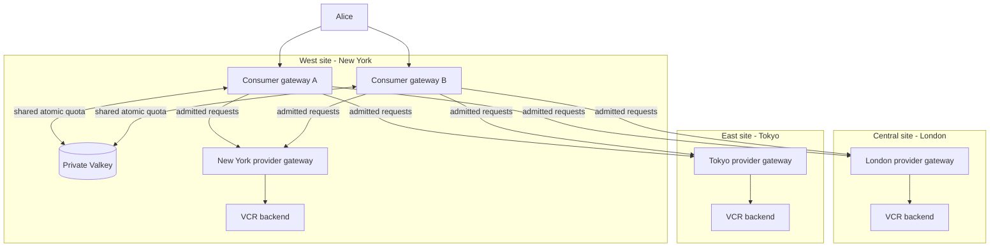
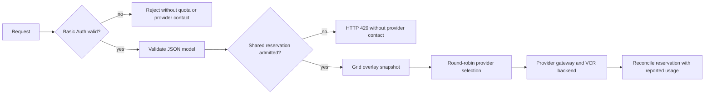

# Distributed Token Quota with Grid Routing

This Forge topology qualifies a shared sliding-window token budget in front
of Grid-managed provider selection. It is separate from the generic
provider-traffic and llm-d examples.



The city names are illustrative aliases for the `west`, `central`, and `east`
test sites; they do not assert literal geographic placement.

The New York (`west`) cluster runs two independently addressable Praxis consumer deployments:
`consumer-gateway-a` and `consumer-gateway-b`. Basic Auth gates access before
both consumers apply Alice's shared rule-level sliding-window budget through
one authenticated, cluster-private Valkey service. London (`central`) and Tokyo
(`east`) remain attributable provider sites with their own VCR-backed provider
gateways.

The qualification admits only the `alice` Basic Auth principal, so its model-matched
limiter rule represents Alice's budget. Both gateway instances address the same Valkey
key. The quota therefore follows Alice's requests while Grid rotates admitted
traffic among New York, London, and Tokyo; a regional route change never creates
fresh capacity.

Current upstream AI keys this state by namespace and rule rather than consuming
the authenticated username directly. Adding more independently budgeted users
requires the trusted principal-key contract tracked in Grid issue 101.

## Request Flow



The routing contract is Grid selection groups with `noMetrics` scoring and
`selection_policy.mode: roundRobin`. No llm-d, EPP, pressure generator, queue
metric, or KV-cache metric is part of this topology. Grid publishes routing
state asynchronously and is not consulted during quota admission.

Valkey owns shared quota state only. Provider round-robin counters remain local
to each consumer; this topology does not claim a globally synchronized provider
sequence, cross-cluster Valkey reachability, or Valkey high availability.

The Valkey password and connection URL are delivered through the `valkey-auth`
Kubernetes Secret. Consumers receive the URL through a Secret-backed environment
variable; the Praxis configuration supports the exact `${ENV_VAR}` form for this
backend URL. The service is ClusterIP-only and its NetworkPolicy permits access
only from the two quota-client consumer pods.

Before distributed measurement, the harness must wait for both consumers to
serve the same overlay revision. Consumer restarts are not quota resets in this
topology because the quota state remains in Valkey.

## What This Demonstrates

| Capability | Behavior |
|---|---|
| Alice's sliding-window quota | One 60-token rolling window with a fixed 15-token reservation. |
| Horizontal gateway scaling | Consumers A and B enforce the same Valkey namespace and Alice rule. |
| Concurrent admission | Valkey serializes reservations against the shared budget. |
| Actual-usage settlement | `token_count` records provider-reported usage before the limiter settles the reservation. |
| Hard enforcement | Exhausted capacity returns 429 before `intelligent_route` or provider contact. |
| Regional provider selection | Admitted requests rotate across New York, London, and Tokyo. |
| Routing-independent quota | Changing the provider region does not change Alice's quota key or capacity. |
| Restart and window recovery | State survives consumer restarts and capacity returns as usage ages out. |

The shared rule uses the schema supported by upstream Praxis AI:

```yaml
filter: token_rate_limit
backend:
  kind: valkey
  url: "${TOKEN_RATE_LIMIT_VALKEY_URL}"
  namespace: praxis:grid-token-rate-limit
rules:
  - name: alice-shared-budget
    match:
      headers:
        x-model: Qwen/Qwen3-0.6B
    algorithm: sliding_window
    window: 60s
    capacity: 60
    reserved_tokens: 15
    reservation_timeout: 30s
```

The single-principal Basic Auth gate runs first. `json_body_field` then derives
`X-Model` from the validated request body before the limiter matches the rule.
Requests that are not authenticated as Alice, malformed payloads, unrelated
paths, and other models do not reserve from Alice's inference budget. Health and
administration use the separate admin listener and do not traverse this chain.

## Regional Example

| Request | Entry gateway | Selected provider site | Alice's quota |
|---|---|---|---|
| 1 | New York consumer A | New York (`west`) | Shared window |
| 2 | New York consumer B | London (`central`) | Same shared window |
| 3 | New York consumer A | Tokyo (`east`) | Same shared window |
| 4 | New York consumer B | New York (`west`) | Same shared window |

This is the important separation: Valkey answers whether Alice may spend more
tokens, while Grid answers which eligible regional provider should serve an
admitted request. Neither provider identity nor region participates in the
quota key.

## Expected Behavior

1. Requests with invalid credentials stop at Basic Auth.
2. Alice's requests arriving through either consumer reserve from the same
   Valkey-backed window.
3. An admitted request selects a provider from the accepted in-memory Grid
   overlay; changing providers does not create a new budget.
4. When the shared window cannot cover another reservation, the consumer
   returns 429 without selecting or contacting a provider.
5. Subsequent capacity reflects settlement and normal sliding-window expiry.

The validation must capture every non-2xx response and verify provider request
counts independently. It must not infer quota admission merely from timing or
flush Valkey to simulate recovery.

## Gateway Build Features

The Praxis AI gateway image must enable both experimental filters used by this
topology:

```text
token-rate-limit-filter,praxis-filter/basic-auth-filter
```

> **Published-image limitation:** The standard
> `ghcr.io/praxis-proxy/ai:0.3.0` image does not contain these optional
> filters because they are experimental, so it cannot run this qualification.
> Supply a feature-enabled Praxis AI image explicitly. Grid publishes no
> alternate AI rollup.

The second entry enables Basic Auth in AI's released `praxis-filter`
dependency. It does not require a Praxis source checkout, Cargo patch, Git
revision, or fork pin. Build AI from its own clean source tree and committed
lockfile. Basic Auth stores the qualification credential in configuration and
is not the production identity mechanism proposed by Grid issue 101.

AI v0.3.0's `Containerfile` does not expose a Cargo-feature build argument.
Prepare a temporary Containerfile outside the AI worktree that adds the exact
feature expression to both build-stage `cargo build` commands, then label the
result so the qualification can verify its contract before creating clusters:

```bash
AI_REPO=/path/to/clean/praxis-proxy-ai
BUILD_DIR="$EVIDENCE_DIR/ai-image"
mkdir -p "$BUILD_DIR"
sed 's/cargo build --release -p praxis-ai-proxy/cargo build --release -p praxis-ai-proxy --features token-rate-limit-filter,praxis-filter\/basic-auth-filter/' \
  "$AI_REPO/Containerfile" > "$BUILD_DIR/Containerfile"

docker build \
  --file "$BUILD_DIR/Containerfile" \
  --label 'org.praxis-proxy.ai.features=token-rate-limit-filter,praxis-filter/basic-auth-filter' \
  --tag "praxis-ai:$IMAGE_TAG" \
  "$AI_REPO"
```

The temporary file is build input, not an AI source change. Do not add a Praxis
path dependency or compose source from another checkout. The label is an early
provenance check; gateway configuration loading remains the authoritative check
that both filters are registered in the binary.

## Running the qualification

The qualification is a first-class xtask command. It materializes the Forge
configuration with the exact locally built images, verifies the resolved
references match what it loads into Kind (every qualification workload uses
`pullPolicy: Never`, so a tag mismatch is rejected), deploys the topology in
cross-cluster dependency order, runs every scenario, writes machine-readable
evidence, and tears the clusters down.

```bash
# IMAGE_TAG is the tag of your locally built praxis-ai / grid-operator /
# grid-overlay-sync images (all three share one tag).
cargo xtask env run-grid-token-rate-limit-qualification \
  --run-id quota-a1b2c3 \
  --image-tag "$IMAGE_TAG" \
  --evidence-dir "$EVIDENCE_DIR"
```

Pass `--keep` to leave the clusters running for debugging. Evidence is written
to `results.json` (machine-readable) and `summary.txt` (human-readable) in the
evidence directory; neither contains credentials, authorization values, the
Valkey password, or kubeconfig contents.

Each invocation uses a unique validated run identity for its Forge environment,
Kind clusters, kubectl contexts, Docker network, resolved Forge file, and probe
names. The run-id option is optional; use a lowercase DNS-safe value such as
quota-a1b2c3 for CI or reproducibility. Values must be 1-24 characters,
contain only lowercase ASCII letters, digits, and hyphens, and start and end
with an alphanumeric character. Explicit collisions fail before cluster
creation; omitted IDs are generated and checked for collisions.

Physical names are run-scoped, while logical site names (west, central, east),
GridNetwork identity, provider candidate IDs, attribution, and the quota
namespace remain stable. The runner records its ownership plan and deletes only
resources created by that invocation. Resolved Forge files are removed after
successful teardown, and a collision or cleanup failure is never reported as a
qualification pass.

The runner creates all clusters first, applies independent base stacks to every
site, and only then applies stacks that consume cross-cluster captures. Directly
applying one cluster's complete stack list cannot satisfy those dependencies.
